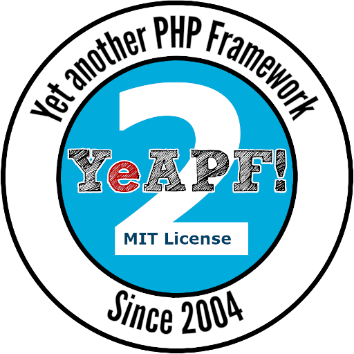
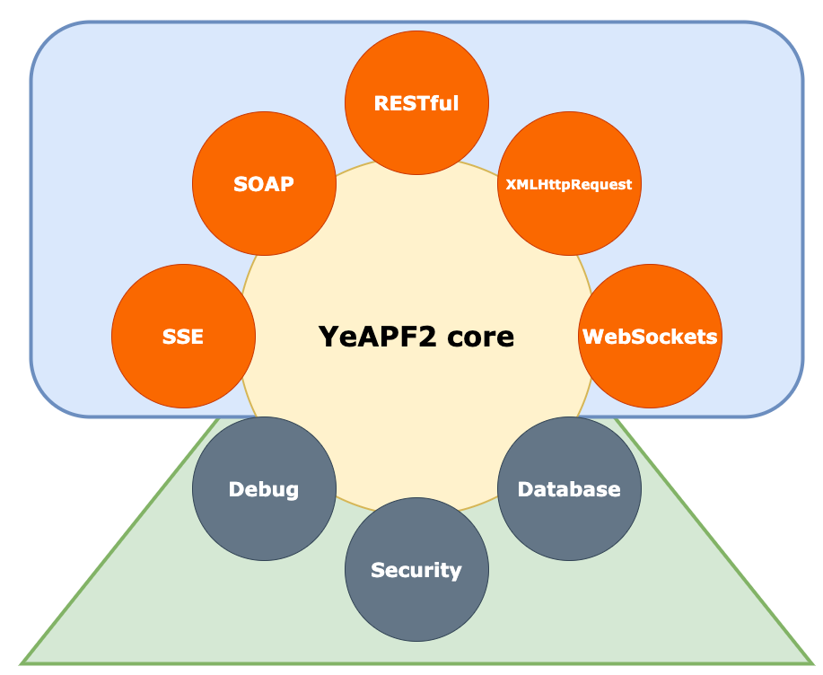

# YeAPF2

Second incarnation of the YeAPF flexible framework

(C) 2020 Esteban D.Dortta released under MIT licence for public domain usage.

#### TL;DR

Basic steps

```bash
$ cd www
$ mkdir test
$ cd test
$ composer require edortta/yeapf2
```


#### The name

YeAPF2 means Yet Another PHP Framework the Second and the name is a little joke with YACC (Yet Another Compiler of Compilers).

#### The idea

Anyway the ideia behind YeAPF2 is to empower the solitaire programmer or little team of ones to deliver high reliable, scalable and confident services. No matters if it is a SOAP WebService, RESTFul Service, XMLHTTPRequest (a.c.a Ajax) all of them are just considered as interfaces to what really matters: delivery high performance systems.



YeAPF2 does not impose a way of programming or a style of development.
Basically, the programmer can - at any time - make use of all the tools that PHP itself makes available or those of another set of a competitor.

#### The differences with the first version

While the first version of YeAPF focused heavily on first-level functions, YeAPF2 bet more on classes and isolation layers.

Be that as it may, there are still some top-level function but we've kept them to a minimum. In this release there is better error and exception handling and a horizontally scalable systems-oriented approach.

Another thing we have done is to facilitate the configuration and cleaning scheme. With that we hope to further reduce the learning line and facilitate the entry of new programmers.

#### The future

YeAPF2, like its first version, has a large part written in Javascript. Some years ago we decided to keep the 'P' in the name itself that - in percentage - there is more javascript than php.

This trend continues in YeAPF2 and will be further strengthened as we think of mirroring YeAPF2 to work in Node. In other words, PHP would be just an option.

#### Developing

In order to keep things simpler as possible, we can use a modified git command. One for a test application and other for yeapf2 development.

These tools depends on .git-app and .git-y2 folders that are just renamed .git folders.

You simply add these alias to bash_rc or zprofile configuration file as shown here:

```bash
alias gity2='git --git-dir=.git-y2'
alias gitapp='git --git-dir=.git-app'
```

Once you have these aliases installed, you just restart your terminal and use them as you does with `git` command. `gity2` for pull modifications from YeAPF2 and `gitapp` for your application.

#### How to contribute

As it is a one-only-man project, your concrete contribution will be a good reward for this work.

You can use PayPal in order to make a donation in [U$S](https://www.paypal.com/donate?hosted_button_id=VWSWDWEMLA95Q) or [BRL (R$)](https://www.paypal.com/donate?hosted_button_id=3UKC9GHT6CKN4)

Or in ETH: `0x8735b3070e6a25c59b4f33c701df2b9df259ac36` (Minimum of 0,02 ETH)

#### Colophon: the bad news

Last but not least, YeAPF2 is not compatible with YeAPF. Applications made in YeAPF must be manually migrated to YeAPF2.

While YeAPF maintained compatibility with PHP 5.x YeAPF2 is already born on PHP7.4. This closes a cycle and opens one with cleaner code that is easier to maintain.

That is the reason why we add the '2' to the name.

The good news is that the communication protocols remain the same and the Javascript part has not changed much since we came with this orientation since the first version of YeAPF.

That means that if you used YeAPF in a Cordova application - for example - and you want to migrate just the server you can while keeping your client as is